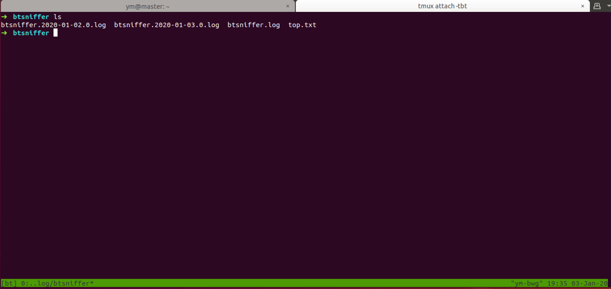

# BT种子嗅探器（BT Sniffer）

加入BT网络，收集发布的种子信息。

Collect latest bit torrents.

## 要求

1. 独立的公网IP
2. Git，JDK8，Maven3的运行环境。
3. 占用6881端口

## 构建和运行

1. 克隆master源码
```shell
$ git clone https://github.com/yanggeorge/btsniffer.git
```

2. 构建打包
```shell
$ cd btsniffer &  mvn clean package -DskipTests
```

3. 后台运行
```shell
$ nohup java -jar -Dio.netty.leakDetectionLevel=advanced -XX:-OmitStackTraceInFastThrow target/btsniffer-1.0.0-SNAPSHOT.jar --spring.profiles.active=test  > /dev/null 2>&1 &
```


| 参数 | 说明 |
| :------ | :----- |
| -Dio.netty.leakDetectionLevel=advanced | netty探测是否有内存泄露 | 
| -XX:-OmitStackTraceInFastThrow | 不要忽略堆栈打印 |
| --spring.profiles.active=test | 使用测试的profile |
------

默认的日志路径是`/var/log/btsniffer`

## 查看日志

1. 查看收集到的种子元信息（没有去重）



## 注意

通常需要运行二十分钟左右才开始获取元信息。因为这是BT网络的特性，新加入的节点并不会立刻加入到其它节点的路由表中。

但是当运行的时间越来越长。则交互会越来越多。
