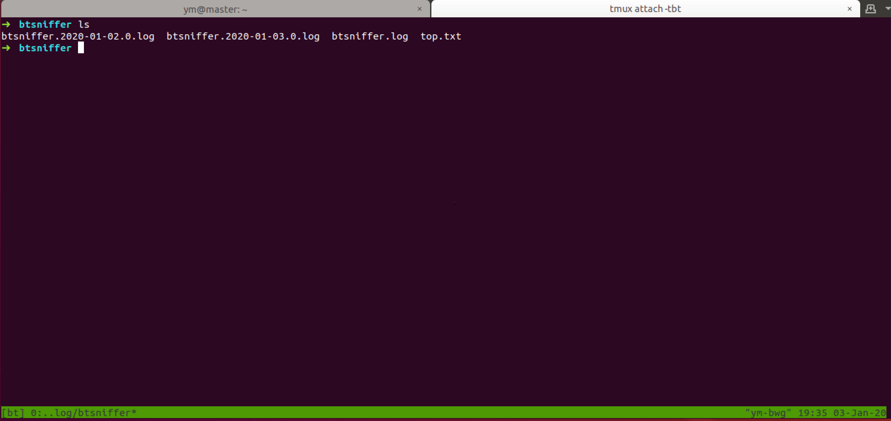

# BT种子嗅探器（BT Sniffer）

加入BT网络，收集发布的种子信息。

Collect latest bit torrents.

## 要求

1. 独立的公网IP
2. Git，JDK8，Maven3的运行环境。
3. 占用6881端口

## 构建和运行

1. 克隆master源码
```shell
$ git clone https://github.com/yanggeorge/btsniffer.git
```

2. 构建打包
```shell
$ cd btsniffer &  mvn clean package -DskipTests
```

3. 后台运行
```shell
$ nohup java -jar -Dio.netty.leakDetectionLevel=advanced -XX:-OmitStackTraceInFastThrow target/btsniffer-1.0.0-SNAPSHOT.jar --spring.profiles.active=test  > /dev/null 2>&1 &
```


| 参数 | 说明 |
| :------ | :----- |
| -Dio.netty.leakDetectionLevel=advanced | netty探测是否有内存泄露 | 
| -XX:-OmitStackTraceInFastThrow | 不要忽略堆栈打印 |
| --spring.profiles.active=test | 使用测试的profile |
------

默认的日志路径是`/var/log/btsniffer`

## 查看日志

1. 查看收集到的种子元信息（没有去重）

```shell
$ cat *.log |grep -a name= | tail 
  2020-01-02 15:00:22,734 [metadataExecutor-0] INFO  c.t.b.b.m.MetadataRequestHandleService.handleMetadata(65) - infoHashHex=62545e5df32b5077b69c48eeb84b40552e2add5c|name=Microsoft Office 2019 Pro Plus v.1908.11929.20376 Oct 2019 By Generation2.img|length=3515320320
  2020-01-02 15:01:06,538 [metadataExecutor-0] INFO  c.t.b.b.m.MetadataRequestHandleService.handleMetadata(65) - infoHashHex=62545e5df32b5077b69c48eeb84b40552e2add5c|name=Microsoft Office 2019 Pro Plus v.1908.11929.20376 Oct 2019 By Generation2.img|length=3515320320
  2020-01-02 15:01:26,617 [metadataExecutor-0] INFO  c.t.b.b.m.MetadataRequestHandleService.handleMetadata(65) - infoHashHex=79e764fe57b2f042217a42126bae52be6c801c87|name=RarLab.WinRAR.v3.93.Cracked-EAT|length=null
  2020-01-02 15:01:40,302 [metadataExecutor-0] INFO  c.t.b.b.m.MetadataRequestHandleService.handleMetadata(65) - infoHashHex=79e764fe57b2f042217a42126bae52be6c801c87|name=RarLab.WinRAR.v3.93.Cracked-EAT|length=null
  2020-01-02 15:01:41,634 [metadataExecutor-0] INFO  c.t.b.b.m.MetadataRequestHandleService.handleMetadata(65) - infoHashHex=79e764fe57b2f042217a42126bae52be6c801c87|name=RarLab.WinRAR.v3.93.Cracked-EAT|length=null
  2020-01-02 15:01:50,413 [metadataExecutor-0] INFO  c.t.b.b.m.MetadataRequestHandleService.handleMetadata(65) - infoHashHex=6254ecf758a0adf45a8563273804a30cb67c76b8|name=Doctor.Who.2005.7x12.Nightmare.In.Silver.HDTV.x264-FoV.mp4|length=319569132
  2020-01-02 15:01:57,517 [metadataExecutor-0] INFO  c.t.b.b.m.MetadataRequestHandleService.handleMetadata(65) - infoHashHex=62545e5df32b5077b69c48eeb84b40552e2add5c|name=Microsoft Office 2019 Pro Plus v.1908.11929.20376 Oct 2019 By Generation2.img|length=3515320320
  ...
```




## 性能

通常需要运行二十分钟左右才开始获取元信息。因为这是BT网络的特性，新加入的节点并不会立刻加入到其它节点的路由表中。

但是当运行的时间越来越长。则交互会越来越多。

部署在搬瓦工上(1cpu/1G内存),从2019-2-17日运行到2019-3-14日持续稳定运行，运行内存200M。

3月14日日志显示交互得到3.5万个元数据（含重复）。

通过分析元数据的接收日志，可以得到3月14日接收到1.6万新的元数据（不重复是指这1.6万在2月17日至3月13日未接收到）。

从gc日志可以看到3月14日，minor gc的频率大约 10次/min， full gc的频率为6次/hour。
